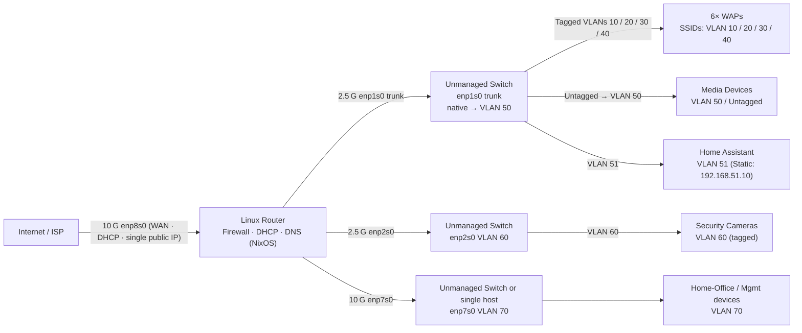

# Home Network Router & VLAN Architecture - Design Document <!-- omit in toc -->

## Table of Contents
1. [Overview](#overview)
2. [Physical Topology & Devices](#physical-topology--devices)
3. [Linux Distribution Options for the Router](#linux-distribution-options-for-the-router)
4. [Core Networking Software](#core-networking-software)
5. [Security Considerations](#security-considerations)

---

## Overview
You are building a single-box Linux router (running **NixOS**, see [OS options](#linux-distribution-options-for-the-router)) that segments home traffic into **eight VLAN-backed subnets**:

| VLAN | Purpose                       | Internet Access | Notes |
|------|------------------------------|-----------------|-------|
| 10   | Internet-only IoT devices    | ✔︎              | Wi‑Fi SSID #1 |
| 20   | Home‑automation devices      | ✖︎              | Wi‑Fi SSID #2 |
| 30   | Guest network                | ✔︎              | Wi‑Fi SSID #3 |
| 40   | Home‑user devices            | ✔︎              | Wi‑Fi SSID #4 |
| 50   | Media (Apple TV, consoles)   | ✔︎              | Wired only |
| 51   | Home‑Assistant               | ✔︎              | Wired only · **Static IP 192.168.51.10** (MAC `d8:3a:dd:b7:09:e2`) |
| 60   | Security cameras             | ✖︎              | Wired, dedicated NIC (**tagged**) |
| 70   | Home‑office / Management     | ✔︎ (admin-only) | Private 10 G link |

Access points now connect directly to the router and tag VLANs for wireless clients. Small unmanaged switches sit between each router interface and its devices (except the WAN `enp8s0`), so wired endpoints such as media players and Home Assistant use these switches for VLAN‑tagged links. The `enp1s0` trunk treats any untagged frame as VLAN 50 by default.

---

## Physical Topology & Devices

| Layer | Device / Medium | Key Specs / Role |
|-------|-----------------|------------------|
| ISP edge | **GPON/Active‑E ONT** | Converts fiber to 10 GbE copper (RJ‑45) hand‑off. |
| Router | Desktop PC | 4 × NICs (2 × 10 G, 2 × 2.5 G); runs **NixOS**. |
| WAPs (×6) | Wi‑Fi 6/6E APs | Connected via unmanaged switch on `enp1s0`; broadcast 4 SSIDs (VLAN 10/20/30/40). |
| Camera segment | PoE switch (optional) | Unmanaged switch on `enp2s0`, uplink **tagged VLAN 60** only. |
| Home‑office link | 10 G DAC / RJ‑45 | `enp7s0` to unmanaged switch or single device (VLAN 70). |
| Endpoint pools | • Media (VLAN 50)   • Home Assistant (VLAN 51, static IP) | Reach router through the `enp1s0` switch; untagged devices land in VLAN 50. |

**Interface role map:**
- **enp8s0** — 10 G WAN uplink (DHCP; single public IP)
- **enp7s0** — 10 G management/office (VLAN 70) via unmanaged switch or direct host
- **enp1s0** — 2.5 G trunk via unmanaged switch; untagged frames → VLAN 50 (VLANs 10/20/30/40/50/51)
- **enp2s0** — 2.5 G trunk via unmanaged PoE switch for cameras (VLAN 60 **tagged**)

---

## Linux Distribution Options for the Router

| Distro | Pros | Cons |
|--------|------|------|
| **NixOS ★ Chosen** | Declarative config in Git; atomic rollbacks; reproducible builds; fresh kernels available; great for infra‑as‑code. | Steeper learning curve; initial install manual; console access needed for rollbacks if networking fails. |
| **Ubuntu Server LTS** | 10‑yr support, huge community, netplan YAML, easy cloud‑init imaging. | Slower kernel updates; some dislike netplan abstraction. |
| **Debian Stable** | Extremely reliable, minimal defaults, predictable policies. | Older kernel/userspace; might need back‑ports for bleeding‑edge NICs. |
| **Fedora Server** | Latest kernels/modules, SELinux enforcing, nftables by default. | 13‑month lifecycle; more frequent upgrades. |
| **AlmaLinux / Rocky Linux** | RHEL‑compatible stability, SELinux enforcing, 10‑yr support. | Older kernel; smaller community docs. |
| **openSUSE Leap / Tumbleweed** | YaST GUI, Btrfs snapshots, firewall‑D. | Leap = older kernel; Tumbleweed = rolling & potentially disruptive. |
| **Arch Linux** | Rolling, freshest drivers; minimal install. | Requires constant updates; break‑fix risk; no LTS channel. |
| **VyOS** | Router‑centric CLI, atomic commits, BGP/OSPF built‑in. | Appliance‑like (limited general packages); separate upgrade path. |
| **OpenWrt x86‑64** | Tiny, LuCI web UI, router‑oriented. | Smaller repos; advanced configs manual. |

*NixOS wins for this project due to its reproducibility and Git‑ops workflow.*

---

### Core Networking Software

Recommendations:

| Layer                     | Pick                                                   |
| ------------------------- | ------------------------------------------------------ |
| Routing/NAT               | **nftables** (`networking.nftables.enable = true`)     |
| Basic Firewall            | **NixOS firewall** defaults + custom nft snippets      |
| DHCP & DNS (all-in-one)   | **dnsmasq**                                            |
| Split DHCP/DNS (advanced) | **Kea** + **Unbound**                                  |
| Dynamic routing           | **None** (enable FRR later if you add a second router) |
| VPN                       | **WireGuard** into VLAN 70                             |

#### Routing / NAT

| Option                                | Pros                                                                                 | Cons                                                                        | **NixOS module / attr**                                                                 | **Recommendation**                                               |
| ------------------------------------- | ------------------------------------------------------------------------------------ | --------------------------------------------------------------------------- | --------------------------------------------------------------------------------------- | ---------------------------------------------------------------- |
| **Kernel IP forwarding + `nftables`** | Unified IPv4/IPv6 rule‑set, sets/maps, native counters, active upstream development. | Fewer legacy HOWTOs; you write rules or use the NixOS firewall abstraction. | `networking.nftables.enable = true;` `networking.firewall` now emits nft by default. | **★ Use this.** Best future‑proof choice.                        |
| `iptables-legacy` (compat layer)      | Lets legacy apps inject rules.                                                       | Deprecated; split tables; IPv6 separate.                                    | Available as `pkgs.iptables`; not enabled unless you install it.                        | **Avoid** unless some niche software insists on iptables syntax. |

#### Firewall

| Option                                         | Pros                                                                  | Cons                                                 | NixOS hook                                                   | Recommendation                                            |
| ---------------------------------------------- | --------------------------------------------------------------------- | ---------------------------------------------------- | ------------------------------------------------------------ | --------------------------------------------------------- |
| **NixOS built‑in firewall** (nftables backend) | Declarative; integrates with NixOS networking options; good defaults. | Expressiveness limited vs raw nft for exotic setups. | `networking.firewall.enable = true;` (default true)          | **★ Start here.** Add raw nft snippets only where needed. |
| **Raw `nftables` rules**                       | Full power; sets, maps, counters, flowtables.                         | Must hand‑roll rules; easier to mis‑order chains.    | `networking.nftables.rulesFile = "/etc/nixos/nftables.nft";` | Use for fine‑grained inter‑VLAN policies & NAT.           |

#### DHCP & DNS

| Component                              | Software    | Pros                                                                         | Cons                                             | NixOS option                      | Recommendation                                  |
| -------------------------------------- | ----------- | ---------------------------------------------------------------------------- | ------------------------------------------------ | --------------------------------- | ----------------------------------------------- |
| **DHCP + DNS in one**                  | **dnsmasq** | Tiny footprint, VLAN‑aware pools, local DNS cache, easy ad‑hoc host records. | Not multi‑master; limited HA; not authoritative. | `services.dnsmasq.enable = true;` | **★ Ideal for a single NixOS router.**          |
| **DHCP only**                          | **Kea**     | Modern JSON API, high lease performance, IPv6, HA pairs, hook plugins.       | Separate process from DNS; config heftier.       | `services.kea.enable = true;`     | Use if you need HA DHCP or advanced lease APIs. |
| **DNS only (recursive)**               | **Unbound** | DNSSEC validation, DNS‑over‑TLS, RPZ blocking, small.                        | Requires separate DHCP (dnsmasq or Kea).         | `services.unbound.enable = true;` | Pair with Kea if you split roles.               |
| **DNS only (authoritative/recursive)** | **Bind 9**  | Full RFC set, dynamic updates, views.                                        | Large code base; heavier memory.                 | `services.bind.enable = true;`    | Only if you need authoritative zones.           |

#### Dynamic Routing Protocols (optional)

| Software            | Pros                                                     | Cons                                        | NixOS module                    | Recommendation                                                   |
| ------------------- | -------------------------------------------------------- | ------------------------------------------- | ------------------------------- | ---------------------------------------------------------------- |
| **FRRouting (FRR)** | OSPFv2/3, BGP, IS‑IS, RIP; industry standard; vtysh CLI. | Overkill for single router; learning curve. | `services.frr.enable = true;`   | **Use only** if you add a second router, lab VRFs, or multi‑WAN. |
| BIRD                | Lightweight, simple configs, BGP/OSPF.                   | Smaller community, fewer tutorials.         | `services.bird2.enable = true;` | Alternative to FRR if you prefer BIRD syntax.                    |

#### VPN (optional)

| Tool          | Pros                                                                                  | Cons                                       | NixOS module                                      | Recommendation                                          |
| ------------- | ------------------------------------------------------------------------------------- | ------------------------------------------ | ------------------------------------------------- | ------------------------------------------------------- |
| **WireGuard** | Kernel crypto, ~1 Gbps+ throughput, minimal config, mobiles & OSes support natively.  | Key‑pair auth only (manage keys securely). | `services.wireguard.interfaces.<name> = { ... };` | **★ Enable** for secure access to VLAN 70 mgmt network. |
| OpenVPN       | Mature TLS stack, username/password, PAM, LDAP.                                       | Slower (user‑space), more tuning.          | `services.openvpn.servers.<name> = { ... };`      | Use only if you need rich auth plugins.                 |

---

## Security Considerations

| # | Concern | NixOS / Network Tasks |
|---|---------|-----------------------|
| **1** | **Default‑deny firewall** | Default drop all inter‑VLAN; allow only explicit flows. NAT only for VLANs 10 / 30 / 40 / 50 / 51 / 70. |
| **2** | **Camera VLAN isolation** | Explicit `reject` for `192.168.60.0/24 -> WAN`. Cameras cannot reach other VLANs. |
| **3** | **Admin plane isolation** | SSH/HTTPS bound only to router IPs in VLAN 70 and VLAN 40 (family); nftables blocks other VLANs. |
| **4** | **Timely patching** | Daily `nixos‑upgrade` timer or nightly flake rebuild. |
| **5** | **Central logging** | Promtail → Loki in VLAN 70. Loki access restricted to mgmt only. |
| **6** | **Intrusion prevention** | CrowdSec + nftables bouncer. |
| **7** | **802.1X (optional)** | Enable RADIUS if access points support it. |
| **10** | **VLAN‑hopping prevention** | Native VLAN = none (4095). Explicit SSID ↔ VLAN mapping. |

---

## Home Assistant Communication Rules

- **HA (VLAN 51)** → **IoT (10)**:
  TCP/UDP 6053 (ESPHome), 1900 (SSDP), 8008/8009/8443 (Chromecast control), 5540 UDP/TCP + 5541 TCP (Matter)

- **HA (51)** → **Automation (20)**:
  TCP/UDP 6053 (ESPHome), 1900 (SSDP), 8008/8009/8443 (Chromecast control), 5540 UDP/TCP + 5541 TCP (Matter)

- **HA (51)** → **Cameras (60)**:
  TCP 80/443, TCP 554 (RTSP)

- **HA (51)** → **Home (40) & Media (50)**:  
  mDNS 5353/UDP, SSDP 1900/UDP, TCP 8008/8009/8443 (Chromecast)

- **HomeKit Bridge**:  
  TCP range 51720–51750, mDNS 5353/UDP reflected

- **Discovery**:
  mDNS reflection enabled between 51↔10, 51↔20, 51↔40, and 51↔50
