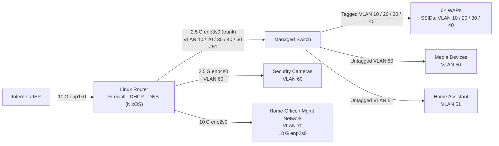

# Home Network Setup
This is a quick repository for how my home network is setup. It's designed to be written as configuration code and now uses a Nix flake with Home Manager to manage applications.

## Overview

There's a full architecture document located in ARCH.md, but as a brief overview, the network is segmented into various VLANs, with some of these not having access to the internet for security purposes. The goal is to only give internet access where needed:

| VLAN | Purpose                       | Internet Access | Notes |
|------|------------------------------|-----------------|-------|
| 10   | Internet-only IoT devices    | ✔︎              | Wi‑Fi SSID #1 |
| 20   | Home‑automation devices      | ✖︎              | Wi‑Fi SSID #2 |
| 30   | Guest network                | ✔︎              | Wi‑Fi SSID #3 |
| 40   | Home‑user devices            | ✔︎              | Wi‑Fi SSID #4 |
| 50   | Media (Apple TV, consoles)   | ✔︎              | Wired only |
| 51   | Home‑Assistant               | ✔︎              | Wired only |
| 60   | Security cameras             | ✖︎              | Wired, dedicated NIC |
| 70   | Home‑office / Management     | ✔︎ (optional)   | Private 10 G link |

The network runs on an iKoolCore R2 Max right now, which has two 10G ports and two 2.5G ports. We break this out into multiple pieces, where most things are sharing the 2.5G ports, except for my office, which has the remaining full 10G port (since the other one is used for the actual ISP connection to prevent bottlenecking).

The main machine is running NixOS, and this repo contains its configurations. Fun fact: This entire setup was done in a Meta Quest 3 VR headset (yes, even building the USB Boot Stick!), hence why there's a security key for a Meta Quest 3 device. NixOS was chosen specifically for its ability to be done entirely in code, which allows for LLMs to write the majority of the configurations for me. This is why the ARCH.md file is critical to be accurate, so that the LLM can know exactly what is needed when building.
