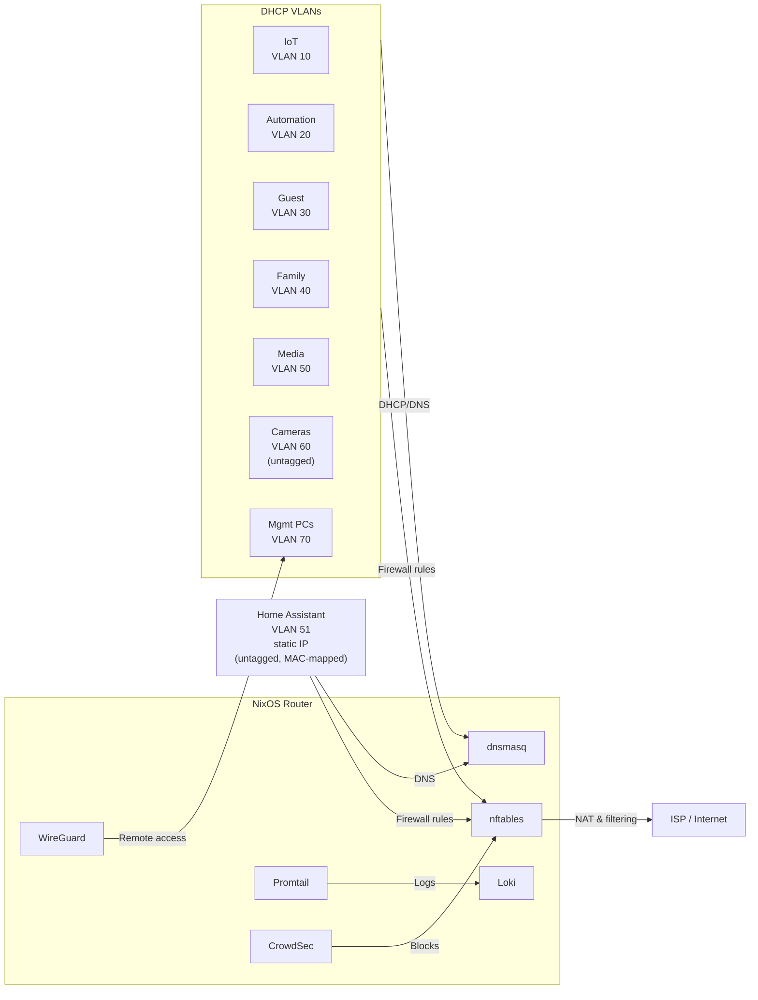
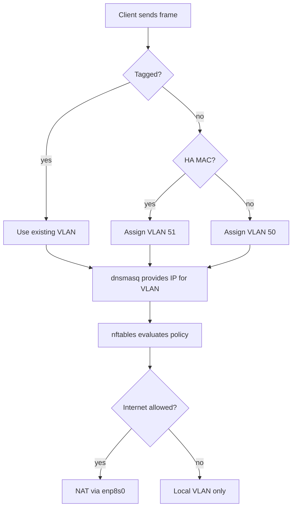
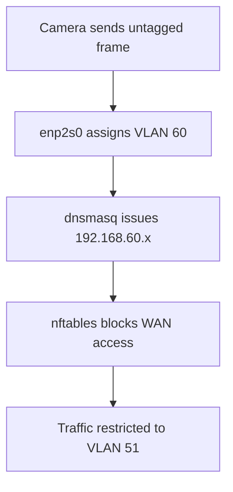
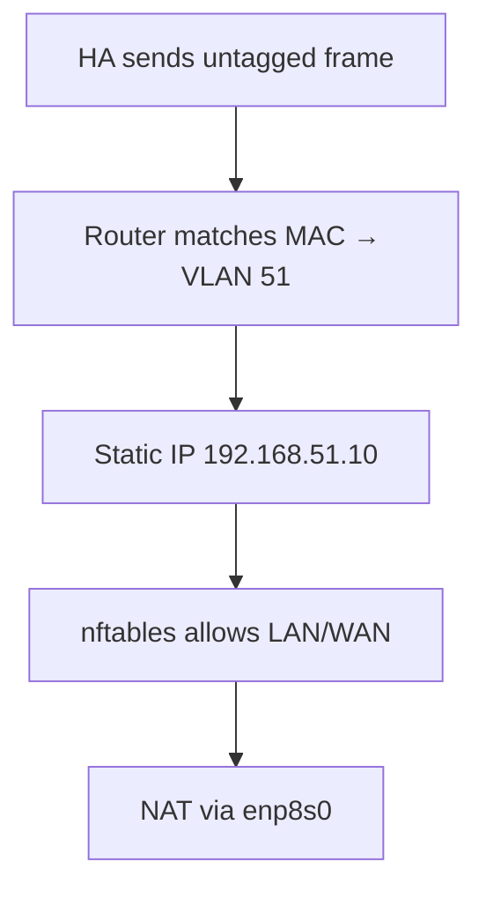
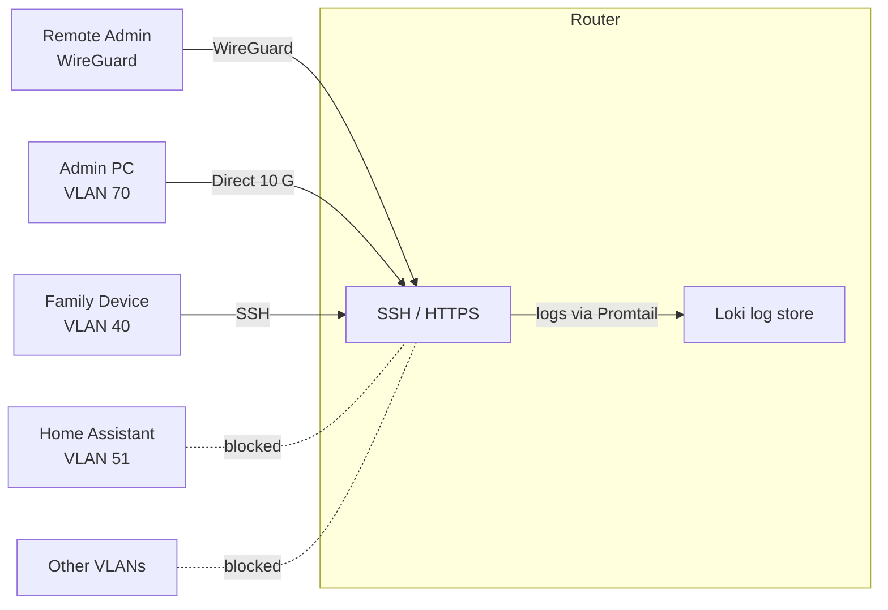
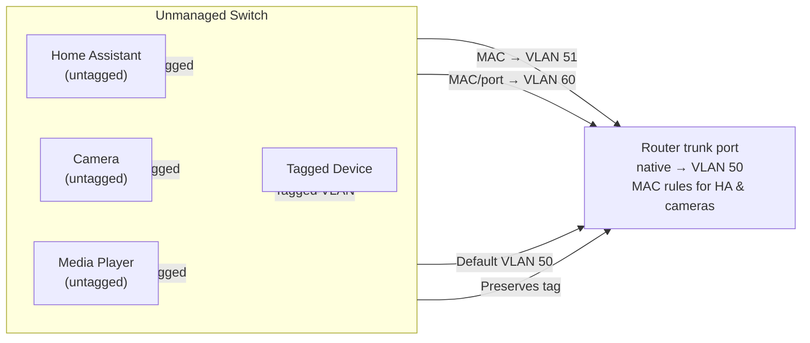

# Software Configuration Guide

This document describes the software components and logical flows required to implement the network layout defined in [ARCH.md](ARCH.md). It focuses on how services on the NixOS router interact with each VLAN and how unmanaged switches and management devices tie into the design.

## Required Software

| Layer | Software | Purpose |
|-------|----------|---------|
| Operating System | **NixOS** | Declarative host for router and services |
| Routing & Firewall | **nftables** with NixOS firewall | IPv4/IPv6 forwarding, NAT and inter‑VLAN policy |
| DHCP & DNS | **dnsmasq** | Per‑VLAN address pools and local DNS cache |
| VPN (remote management) | **WireGuard** | Secure access into VLAN 70 |
| Log shipping | **Promtail** → Loki | Local log storage on the router |
| Intrusion prevention | **CrowdSec** with nftables bouncer | Brute‑force and bot protection |
| Optional advanced DHCP/DNS | **Kea** + **Unbound** | Replace dnsmasq when split services are required |

## Software Integration

## Interface IP & Connectivity Flows

### enp8s0 – WAN

### enp1s0 – Trunk to APs & Tagged Devices (VLANs 10/20/30/40/50/51)

### enp2s0 – Camera Link (VLAN 60)

### enp7s0 – Management / Home‑Office (VLAN 70)

The management VLAN always has internet access through NAT while still reaching administrative services on the router.

### Home Assistant – VLAN 51 (Static IP)

Home Assistant uses a fixed address but still traverses nftables for policy enforcement and NAT for internet access.

## Management Access

Only devices in VLAN 40 and VLAN 70 (or over WireGuard) may SSH into the router; nftables blocks all other VLANs.

## Unmanaged Switch Behaviour

*Each router interface except the WAN uplink uses an unmanaged switch; `enp7s0` may connect directly to a single host.*

---

This guide, paired with the physical layout in `ARCH.md`, ensures both software and hardware aspects of the network are fully defined.
